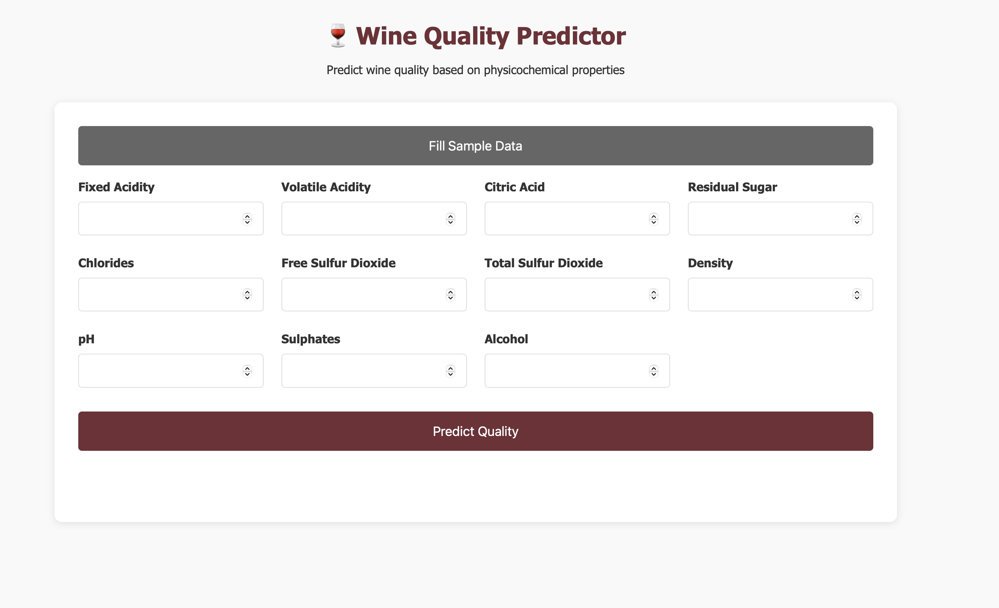

# Wine Quality Predictor 🍷

[Live Demo](https://ml-engineer-zoomcamp.onrender.com)

A web application that predicts wine quality based on physicochemical properties. Simply input the wine's chemical measurements and get an instant quality prediction.




# 1. Problem Description

## Problem
The goal of this project is to develop a machine learning model that can predict the quality of wines based on their physicochemical properties. This predictive model aims to help consumers make informed decisions when purchasing wine by understanding which characteristics contribute to higher quality ratings.

## Why This Matters
- Consumers often find it challenging to select quality wines without expert knowledge
- Wine quality is influenced by various measurable chemical properties
- An accurate prediction model can serve as an objective guide for wine selection
- Understanding key quality indicators can help both consumers and producers

## Practical Application
The solution will analyze various wine features such as:
- Fixed acidity
- Volatile acidity
- Citric acid
- Residual sugar
- Chlorides
- Free sulfur dioxide
- Total sulfur dioxide
- Density
- pH
- Sulphates
- Alcohol content

Using these features, the model will predict a quality score, helping consumers identify potentially high-quality wines based on their chemical composition rather than relying solely on price or brand reputation.

## Expected Outcome
The model will provide:
- Quality predictions on a scale of 0-8
- Insights into which chemical properties most strongly indicate wine quality
- A practical tool for making data-driven wine purchasing decisions

This solution bridges the gap between technical wine analysis and practical consumer decision-making, making wine quality assessment more accessible to the average consumer. If deemed good enough, I will also use it myself when buying wine.

# 2. Deployment Instructions (Render)

To deploy this project using Render, follow these steps:

1. **Create a New Web Service**
   - Go to [Render](https://render.com) and create a new web service.
   - Connect your GitHub repository containing this project.

2. **Configure Deployment Settings**
   - Choose the branch you want to deploy (e.g., `main`).
   - Set the runtime environment to Python 3.

3. **Specify Build and Start Commands**
   - In the 'Build Command' section, specify the following:
     ```
     pip install -r requirements.txt
     or poetry install, which is the default in Render
     ```
   - In the 'Start Command' section, specify the following:
     ```
     gunicorn --worker-class uvicorn.workers.UvicornWorker --bind 0.0.0.0:8000 app:app
     ```

4. **Environment Variables**
   - Add any necessary environment variables in the 'Environment' section (e.g., API keys or configuration settings). Not needed for this project.

5. **Deploy**
   - Click 'Create Web Service' to start the deployment.
   - Render will automatically build and deploy your application.

# Command to Run the Application Using Render

This should be the startup command specified in Render:
```sh
CMD ["gunicorn", "--worker-class", "uvicorn.workers.UvicornWorker", "--bind", "0.0.0.0:8000", "app:app"]
```

